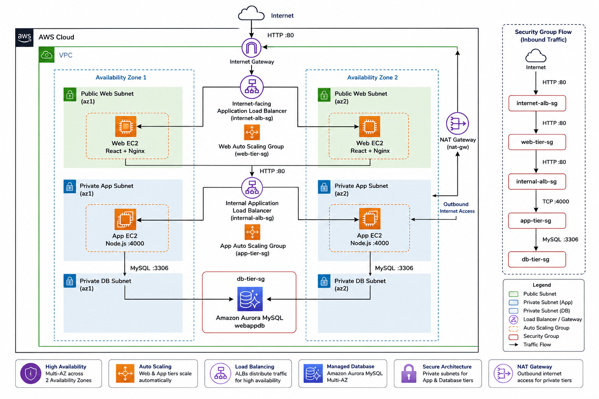

# AWS Highly Available Three-Tier Web Architecture

A production-inspired, highly available and scalable three-tier web architecture deployed on AWS across multiple Availability Zones.

This project demonstrates the deployment of a complete web application infrastructure with network isolation, load balancing, automatic recovery, dynamic scaling, and controlled communication between each architectural layer.

The infrastructure is separated into three tiers:

- **Web Tier** — React + Nginx
- **Application Tier** — Node.js REST API
- **Database Tier** — Amazon Aurora MySQL

---

## Architecture Overview

```text
                                      INTERNET
                                          │
                                     HTTP :80
                                          │
                                          ▼
                               ┌─────────────────────┐
                               │ Internet-facing ALB │
                               │   internet-alb-sg   │
                               └──────────┬──────────┘
                                          │
                                     HTTP :80
                                          │
                     ┌────────────────────┴────────────────────┐
                     │                                         │
             Availability Zone 1                       Availability Zone 2
                     │                                         │
              Public Web Subnet                         Public Web Subnet
                     │                                         │
             ┌───────────────┐                         ┌───────────────┐
             │    Web EC2    │                         │    Web EC2    │
             │ React + Nginx │                         │ React + Nginx │
             │  web-tier-sg  │                         │  web-tier-sg  │
             └───────┬───────┘                         └───────┬───────┘
                     │                                         │
                     └──────────── Web Auto Scaling ────────────┘
                                          │
                                     HTTP :80
                                          │
                                          ▼
                               ┌─────────────────────┐
                               │    Internal ALB     │
                               │  internal-alb-sg    │
                               └──────────┬──────────┘
                                          │
                                     TCP :4000
                                          │
                     ┌────────────────────┴────────────────────┐
                     │                                         │
              Private App Subnet                       Private App Subnet
                     │                                         │
             ┌───────────────┐                         ┌───────────────┐
             │    App EC2    │                         │    App EC2    │
             │    Node.js    │                         │    Node.js    │
             │  app-tier-sg  │                         │  app-tier-sg  │
             └───────┬───────┘                         └───────┬───────┘
                     │                                         │
                     └──────────── App Auto Scaling ────────────┘
                                          │
                                     MySQL :3306
                                          │
                                          ▼
                               ┌─────────────────────┐
                               │    Aurora MySQL     │
                               │      webappdb       │
                               │     db-tier-sg      │
                               └─────────────────────┘
                                  Private DB Subnets
```

The architecture is deployed across **two Availability Zones** to reduce single points of failure.

---

## Architecture Diagram

> A detailed AWS architecture diagram can be added here.

```markdown

```

---

## AWS Services Used

| AWS Service | Purpose |
|---|---|
| **Amazon VPC** | Provides an isolated network for the infrastructure |
| **EC2** | Hosts the Web and Application tiers |
| **Application Load Balancer** | Distributes traffic across healthy EC2 instances |
| **Auto Scaling Groups** | Maintains availability and dynamically adjusts capacity |
| **Amazon Aurora MySQL** | Managed relational database for application data |
| **Internet Gateway** | Provides Internet connectivity to public resources |
| **NAT Gateway** | Provides outbound Internet access to private Application instances |
| **Security Groups** | Controls traffic between infrastructure layers |
| **IAM** | Provides permissions to EC2 instances |
| **AWS Systems Manager** | Provides secure instance administration without exposing SSH |
| **Amazon Machine Images** | Provides reusable images for Auto Scaling instances |
| **Launch Templates** | Defines how Auto Scaling creates new EC2 instances |
| **CloudWatch Metrics** | Provides CPU metrics used by dynamic Auto Scaling |

---

# Network Architecture

The infrastructure uses a dedicated VPC distributed across two Availability Zones.

Each Availability Zone contains three network layers:

```text
Availability Zone 1                 Availability Zone 2

Public Web Subnet                   Public Web Subnet
       │                                   │
     Web EC2                             Web EC2

Private App Subnet                  Private App Subnet
       │                                   │
     App EC2                             App EC2

Private DB Subnet                   Private DB Subnet
       │                                   │
       └────────── Aurora ──────────────────┘
```

This creates a total of **six subnets**:

- 2 Public Web subnets
- 2 Private Application subnets
- 2 Private Database subnets

---

## Internet Connectivity

The Internet-facing Application Load Balancer is deployed in the public network layer.

Public routing uses an Internet Gateway:

```text
Internet
   │
   ▼
Internet Gateway
   │
   ▼
Public Subnets
   │
   ▼
Internet-facing ALB
```

Application EC2 instances are located in private subnets and are not directly reachable from the Internet.

When private Application instances require outbound Internet access, traffic uses a NAT Gateway:

```text
Private App EC2
       │
       ▼
Private Route Table
       │
       ▼
NAT Gateway
       │
       ▼
Internet Gateway
       │
       ▼
Internet
```

The database tier has no direct Internet exposure.

---

# Security Architecture

Security Groups enforce communication between the different application layers.

Instead of exposing every server to the Internet, each tier accepts traffic only from the tier directly above it.

```text
Internet
   │
   │ HTTP :80
   ▼
┌──────────────────────┐
│ Internet-facing ALB  │
│   internet-alb-sg    │
└──────────┬───────────┘
           │
           │ HTTP :80
           ▼
┌──────────────────────┐
│       Web Tier       │
│     web-tier-sg      │
└──────────┬───────────┘
           │
           │ HTTP :80
           ▼
┌──────────────────────┐
│     Internal ALB     │
│   internal-alb-sg    │
└──────────┬───────────┘
           │
           │ TCP :4000
           ▼
┌──────────────────────┐
│   Application Tier   │
│     app-tier-sg      │
└──────────┬───────────┘
           │
           │ MySQL :3306
           ▼
┌──────────────────────┐
│     Aurora MySQL     │
│      db-tier-sg      │
└──────────────────────┘
```

## Security Group Rules

| Security Group | Allowed Inbound Traffic | Source |
|---|---|---|
| `internet-alb-sg` | HTTP `80` | Internet `0.0.0.0/0` |
| `web-tier-sg` | HTTP `80` | `internet-alb-sg` |
| `internal-alb-sg` | HTTP `80` | `web-tier-sg` |
| `app-tier-sg` | TCP `4000` | `internal-alb-sg` |
| `db-tier-sg` | MySQL `3306` | `app-tier-sg` |

This means:

```text
Internet
   ↓
Public ALB
   ↓
Web Tier
   ↓
Internal ALB
   ↓
Application Tier
   ↓
Database
```

A user on the Internet cannot directly access the Application or Database tiers.

EC2 administration is performed through **AWS Systems Manager Session Manager**, avoiding the need to expose SSH port `22` publicly.

---

# Web Tier

The Web Tier hosts the React frontend.

Each Web EC2 instance runs:

- React production build
- Nginx
- Reverse proxy configuration
- Health endpoint

Nginx listens on:

```text
HTTP :80
```

and performs two main functions.

### Frontend requests

```text
Browser
   │
   │ GET /
   ▼
Nginx
   │
   ▼
React build
```

### API requests

React sends requests using:

```text
/api/*
```

Nginx forwards these requests to the Internal Application Load Balancer:

```text
React
   │
   │ /api/transaction
   ▼
Nginx
   │
   ▼
Internal ALB
   │
   ▼
Application Tier
```

The frontend therefore does not need to know the private IP addresses of backend instances.

---

# Application Tier

The Application Tier runs a Node.js REST API on:

```text
TCP :4000
```

Application EC2 instances are located inside private subnets.

They cannot be accessed directly from the Internet.

Requests must follow:

```text
Web Tier
   │
   ▼
Internal ALB
   │
   ▼
Application EC2
```

The backend communicates with Aurora using:

```text
MySQL :3306
```

---

# Backend Service Management

The Node.js backend is managed using **systemd**.

Originally, the application required manual startup:

```bash
node index.js
```

This would not work correctly with Auto Scaling because newly created instances must become operational without manual intervention.

A systemd service was therefore configured to automatically start Node.js during instance boot.

```text
EC2 starts
    │
    ▼
Linux boots
    │
    ▼
systemd
    │
    ▼
Node.js starts
    │
    ▼
Port 4000 available
    │
    ▼
ALB /health check
    │
    ▼
Healthy
```

The configuration is available in:

```text
systemd/app-tier.service
```

---

# Database Tier

The Database Tier uses **Amazon Aurora MySQL**.

The database is deployed in private database subnets.

The application uses:

```text
Database: webappdb
Table: transactions
```

Only instances using `app-tier-sg` are allowed to connect to Aurora on:

```text
TCP :3306
```

The database is therefore not exposed directly to the Web Tier or the Internet.

---

# Load Balancing

Two Application Load Balancers are used.

## Internet-facing ALB

Handles incoming user traffic:

```text
Internet
   │
   ▼
Public ALB
   │
   ▼
Web Target Group
   │
   ├── Web EC2
   │
   └── Web EC2
```

## Internal ALB

Handles communication between the Web and Application tiers:

```text
Web Tier
   │
   ▼
Internal ALB
   │
   ▼
Application Target Group
   │
   ├── App EC2
   │
   └── App EC2
```

The backend EC2 instances therefore remain hidden from Internet users.

---

# Health Checks

Both Load Balancers use health checks to ensure traffic is only routed to operational instances.

### Web Tier

```text
GET /health
```

### Application Tier

```text
GET /health
```

If an instance fails its health checks, the Load Balancer stops sending traffic to it.

When used with Auto Scaling, unhealthy instances can automatically be replaced.

---

# High Availability

Both Web and Application tiers use Auto Scaling Groups distributed across two Availability Zones.

Normal configuration:

| Setting | Value |
|---|---:|
| Minimum capacity | 2 |
| Desired capacity | 2 |
| Maximum capacity | 4 |

This ensures that multiple instances are normally available.

```text
                     Load Balancer
                       /        \
                      /          \
                   EC2-A        EC2-B
                    AZ-1         AZ-2
```

If one instance fails:

```text
EC2-A 💀
   │
   ▼
Auto Scaling detects capacity loss
   │
   ▼
Launch Template
   │
   ▼
New EC2 instance
   │
   ▼
Target Group registration
   │
   ▼
Health Check
   │
   ▼
Healthy
```

---

# Launch Templates and AMIs

Custom Amazon Machine Images were created from configured Web and Application instances.

The AMIs contain the software and configuration required by each tier.

Launch Templates define how new instances should be created:

```text
AMI
 +
Instance Type
 +
Security Group
 +
IAM Role
       │
       ▼
Launch Template
       │
       ▼
Auto Scaling Group
       │
       ▼
New EC2
```

This allows Auto Scaling Groups to automatically replace failed instances.

---

# Dynamic Auto Scaling

A Target Tracking scaling policy was configured for the Web Tier.

Configuration:

| Setting | Value |
|---|---:|
| Metric | Average CPU Utilization |
| Target | 50% |
| Minimum instances | 2 |
| Desired instances | 2 |
| Maximum instances | 4 |
| Instance warmup | 300 seconds |

The objective is to maintain average CPU utilization around the configured target.

```text
                  CPU Load
                     │
              ┌──────┴──────┐
              │             │
           High CPU       Low CPU
              │             │
              ▼             ▼
          Scale Out      Scale In
              │             │
           + EC2          - EC2
```

---

# Load Testing

Dynamic Auto Scaling was validated by intentionally generating CPU load on the Web Tier using `stress-ng`.

Example:

```bash
stress-ng --cpu $(nproc) --timeout 10m
```

CPU utilization increased significantly across the Web instances.

Observed flow:

```text
CPU increases
     │
     ▼
CloudWatch metric
     │
     ▼
Target Tracking Policy
     │
     ▼
Auto Scaling Group
     │
     ▼
Desired capacity increases
     │
     ▼
Launch Template
     │
     ▼
New Web EC2
     │
     ▼
Target Group
     │
     ▼
Health Check
     │
     ▼
Healthy
```

The Auto Scaling Group successfully increased capacity above the normal two instances.

After the artificial load stopped, CPU utilization decreased and the Auto Scaling Group automatically performed **scale-in**, returning toward its minimum capacity.

---

# Failure Testing

High availability was not only configured — it was intentionally tested.

## Web Tier Failure Test

A Web EC2 instance managed by the Auto Scaling Group was manually terminated.

Observed behavior:

1. The instance became unavailable.
2. The Public ALB continued routing traffic to the remaining healthy instance.
3. The Auto Scaling Group detected capacity loss.
4. A replacement EC2 instance was launched automatically.
5. The new instance registered with `web-tier-tg`.
6. The health check passed.
7. The replacement entered service.

The application remained available during the test.

---

## Application Tier Failure Test

The same failure scenario was performed on the Application Tier.

An Application EC2 instance managed by the ASG was terminated.

Observed behavior:

1. The Internal ALB stopped using the failed backend.
2. API requests continued through the remaining healthy backend.
3. The Application Auto Scaling Group launched a replacement.
4. The replacement booted using the configured AMI.
5. systemd automatically started Node.js.
6. `/health` became available.
7. The replacement joined the Target Group as healthy.

No manual application startup was required.

---

# End-to-End Testing

The complete architecture was validated from the browser.

A transaction was created through the React interface.

The request followed:

```text
Browser
   │
   ▼
Internet-facing ALB
   │
   ▼
Web EC2
React + Nginx
   │
   │ /api/transaction
   ▼
Internal ALB
   │
   ▼
Application EC2
Node.js
   │
   │ MySQL :3306
   ▼
Aurora MySQL
   │
   ▼
transactions table
```

The transaction was successfully stored in Aurora and returned through the API to the frontend.

This validated communication across all three application tiers.

---

# Key DevOps Skills Demonstrated

This project demonstrates hands-on experience with:

- AWS VPC architecture
- Multi-AZ infrastructure
- Public and private subnet design
- Route tables
- Internet Gateway
- NAT Gateway
- Security Group chaining
- EC2 administration
- AWS Systems Manager
- Application Load Balancers
- Internet-facing and internal load balancing
- Target Groups
- Health checks
- Auto Scaling Groups
- Launch Templates
- Amazon Machine Images
- Dynamic Auto Scaling
- CloudWatch CPU metrics
- Failure testing
- Load testing
- Linux systemd services
- Nginx reverse proxy
- Node.js application hosting
- Aurora MySQL
- Network isolation
- High availability
- Self-healing infrastructure

---

# Repository Structure

```text
aws-three-tier-web-architecture/
│
├── architecture/
│   └── aws-three-tier-architecture.png
│
├── docs/
│   ├── networking.md
│   ├── high-availability-testing.md
│   └── auto-scaling-test.md
│
├── nginx/
│   └── nginx.conf.example
│
├── systemd/
│   └── app-tier.service
│
├── .gitignore
│
└── README.md
```

---

# Architecture Decisions

| Problem | Solution |
|---|---|
| Direct Internet access to backend | Private Application subnets |
| Direct Internet access to database | Private Database subnets |
| Web server failure | Web Auto Scaling Group |
| Backend server failure | Application Auto Scaling Group |
| Traffic distribution | Application Load Balancers |
| Backend discovery | Internal Application Load Balancer |
| Instance replacement | Auto Scaling + Launch Templates |
| Application startup after replacement | systemd |
| High traffic | Dynamic Auto Scaling |
| Private EC2 outbound Internet requirements | NAT Gateway |
| Traffic isolation | Security Groups |
| Multi-server health management | Target Group health checks |
| SSH exposure | AWS Systems Manager |
| Database management | Amazon Aurora MySQL |


---

# Application Source

The React and Node.js sample application used as the workload is based on the AWS Three-Tier Web Architecture sample.

The AWS infrastructure, VPC design, networking, security configuration, EC2 deployment, load balancing, Linux service configuration, high availability, Auto Scaling configuration, failure testing, and load testing documented in this repository were implemented as part of this project.

Original application sample:

https://github.com/aws-samples/aws-three-tier-web-architecture-workshop

---

## Author

**Albi Lubila**

DevOps / Cloud Engineering Portfolio

GitHub: https://github.com/AlLubila